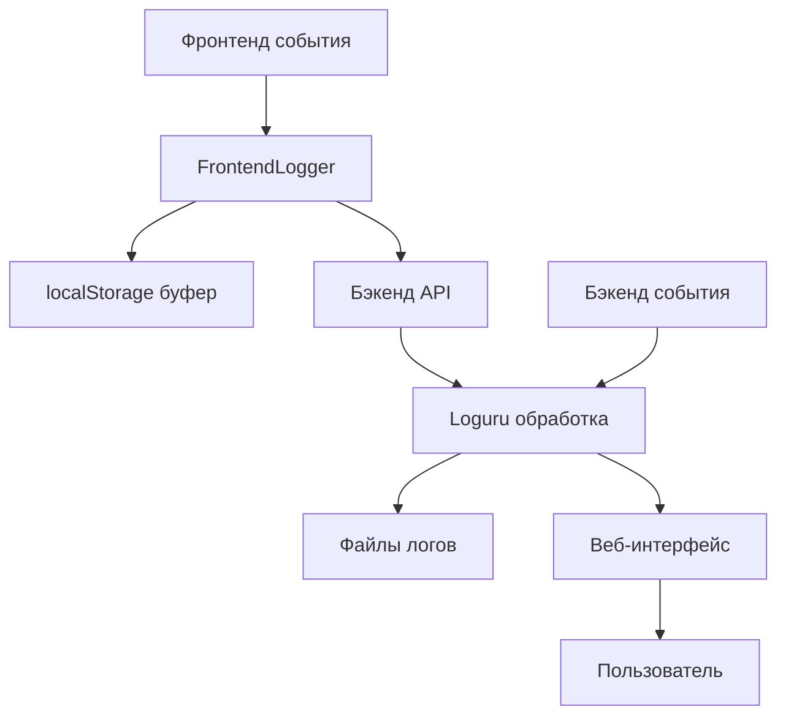

# 📋 Система Логирования - Полное Руководство

## Быстрый старт

### 🚀 Запуск системы
```bash
cd C:\Users\idv\Work\AI_Docs_Generator\AI_Docs_Generator
python main.py
```

### 🌐 Доступ к логам
- **Основной чат:** `http://127.0.0.1:8001/`
- **Просмотр логов:** `http://127.0.0.1:8001/logs`
- **API логов:** `http://127.0.0.1:8001/api/logs/files`

### 📊 Что фиксируется
- ✅ **Все JavaScript ошибки** с полным stack trace
- ✅ **Сетевые ошибки** с метриками производительности
- ✅ **Core Web Vitals** (LCP, FID, CLS)
- ✅ **Пользовательские действия** (клики, ввод, навигация)
- ✅ **Производительность** памяти и загрузки ресурсов
- ✅ **Серверные ошибки** с полной трассировкой

---

## Содержание

1. [Обзор](#обзор)
2. [Архитектура](#архитектура)
3. [API документация](#api-документация)
4. [Веб-интерфейс](#веб-интерфейс)
5. [Конфигурация](#конфигурация)
6. [Тестирование](#тестирование)
7. [Troubleshooting](#troubleshooting)
8. [Примеры использования](#примеры-использования)

## Обзор

Система логирования захватывает **ВСЕ события и ошибки** в приложении ChatBot:

### 🎯 Что фиксируется
- **JavaScript ошибки** - все синтаксические и runtime ошибки с полным stack trace
- **Сетевые проблемы** - HTTP ошибки, таймауты, неудачные запросы
- **Производительность** - Core Web Vitals (LCP, FID, CLS), использование памяти
- **Пользовательские действия** - клики, ввод, навигация, взаимодействия
- **Ресурсы** - ошибки загрузки CSS, JS, изображений
- **Серверные ошибки** - исключения в Python с полной трассировкой

### 📁 Лог файлы
- `backend.log` - основной серверный лог
- `errors.log` - все ошибки с traceback
- `frontend.log` - события с фронтенда
- `backend.jsonl` - структурированные данные
- `slow_requests.log` - медленные запросы

### 🔧 Доступ
- **Веб-интерфейс:** `http://127.0.0.1:8001/logs`
- **API:** `http://127.0.0.1:8001/api/logs/`
- **Фильтры:** по уровню, времени, категориям

---

## Архитектура

### Компоненты



### Поток данных

1. **Фронтенд** захватывает все ошибки и события
2. **Буферизация** в памяти и localStorage
3. **Retry логика** с прогрессивными интервалами
4. **Отправка** на бэкенд через REST API
5. **Запись** в файлы с ротацией
6. **Отображение** в веб-интерфейсе

## API документация

### GET /api/logs/files
**Список доступных лог файлов**

```bash
curl "http://127.0.0.1:8001/api/logs/files"
```

**Ответ:**
```json
{
  "files": [
    {
      "name": "errors.log",
      "size": 2048576,
      "modified": "2025-01-26T10:30:00Z",
      "lines": 15420
    }
  ]
}
```

### GET /api/logs/{filename}
**Содержимое лог файла с фильтрами**

```bash
# Последние 100 строк
curl "http://127.0.0.1:8001/api/logs/errors.log?lines=100"

# Ошибки за последний час
curl "http://127.0.0.1:8001/api/logs/errors.log?since=2025-01-26T09:00:00"

# Только ERROR уровень
curl "http://127.0.0.1:8001/api/logs/errors.log?level=ERROR"
```

**Параметры:**
- `lines` - количество строк (по умолчанию 50)
- `level` - фильтр по уровню (DEBUG, INFO, WARNING, ERROR)
- `since` - фильтр по времени (ISO формат)

### POST /api/logs
**Прием логов с фронтенда**

```javascript
fetch('http://127.0.0.1:8001/api/logs', {
  method: 'POST',
  headers: { 'Content-Type': 'application/json' },
  body: JSON.stringify({
    level: 'ERROR',
    message: 'JavaScript Error occurred',
    context: { filename: 'script.js', lineno: 42 },
    category: 'javascript'
  })
});
```

```python
from loguru import logger

# Настройка логгера
logger.add(
    "data/logs/backend.log",
    rotation="20 MB",
    retention="30 days",
    compression="zip",
    level="DEBUG",
    backtrace=True,
    diagnose=True,
    format="{time:YYYY-MM-DD HH:mm:ss.SSS} | {level:<8} | {message} | {name}:{function}:{line}"
)
```

### 2. Продвинутая система фронтенд-логгирования

JavaScript система с comprehensive захватом всех событий:
#### Основные возможности:
- **Захват всех типов ошибок**: JavaScript, async, ресурсы, сеть
- **Мониторинг производительности**: Core Web Vitals (LCP, FID, CLS)
- **Буферизация и retry логика**: локальное хранение + прогрессивные retry
- **Категоризация логов**: 10+ категорий для структурирования
- **Мониторинг пользовательских действий**: клики, ввод, навигация
- **Мониторинг жизненного цикла**: видимость страницы, сеть, память

#### Контекстная информация:
```javascript
function getContext() {
    return {
        // Базовая информация
        href: location.href,
        userAgent: navigator.userAgent,
        screenWidth: screen.width,
        viewportWidth: window.innerWidth,

        // Состояние приложения
        model: localStorage.getItem('lm_model_id'),
        currentChat: currentChatId,
        userId: currentUserId,

        // Временные метки
        timestamp: Date.now(),
        timezone: Intl.DateTimeFormat().resolvedOptions().timeZone
    };
}
```

#### Категории логирования:
- **`javascript`** - ошибки JavaScript
- **`async`** - необработанные промисы
- **`resource`** - ошибки загрузки ресурсов
- **`network`** - сетевые ошибки и метрики
- **`performance`** - Core Web Vitals и производительность
- **`user-action`** - действия пользователя
- **`lifecycle`** - события жизненного цикла
- **`memory`** - использование памяти
- **`service-worker`** - ошибки Service Worker

### 3. FastAPI - REST API

FastAPI предоставляет REST API для доступа к лог файлам:

- **GET /api/logs/files** - список доступных лог файлов
- **GET /api/logs/{filename}** - содержимое конкретного лог файла
- **GET /logs** - веб-страница просмотра логов
- **POST /api/logs** - прием логов с фронтенда

### 4. Веб-интерфейс

HTML/CSS/JavaScript интерфейс для просмотра логов:

- **Адаптивный дизайн** для всех устройств
- **Фильтры и поиск** в реальном времени
- **Цветовая кодировка** по уровням логирования
- **Автообновление** каждые 30 секунд

## Фронтенд логирование

### Обзор

Продвинутая система фронтенд-логгирования захватывает все возможные события и ошибки на стороне клиента:

### Захватываемые события

#### 1. JavaScript ошибки
```javascript
window.addEventListener('error', (e) => {
    FrontendLogger.error('WindowError', {
        filename: e.filename,
        lineno: e.lineno,
        colno: e.colno,
        error: e.error?.toString(),
        stack: e.error?.stack
    }, 'javascript');
});
```

#### 2. Необработанные промисы
```javascript
window.addEventListener('unhandledrejection', (e) => {
    FrontendLogger.error('Unhandled promise rejection', {
        reason: e.reason?.toString(),
        stack: e.reason?.stack
    }, 'async');
});
```

#### 3. Ошибки ресурсов
```javascript
window.addEventListener('error', (e) => {
    if (e.target !== window) {
        FrontendLogger.error('Resource failed to load', {
            tagName: e.target.tagName,
            src: e.target.src,
            type: e.target.type
        }, 'resource');
    }
}, true);
```

### Мониторинг производительности

#### Core Web Vitals
```javascript
// LCP (Largest Contentful Paint)
new PerformanceObserver((list) => {
    for (const entry of list.getEntries()) {
        FrontendLogger.performance(`LCP ${entry.startTime.toFixed(2)}ms`);
    }
}).observe({ entryTypes: ['largest-contentful-paint'] });

// FID (First Input Delay)
new PerformanceObserver((list) => {
    for (const entry of list.getEntries()) {
        FrontendLogger.performance(`FID ${entry.processingStart.toFixed(2)}ms`);
    }
}).observe({ entryTypes: ['first-input'] });

// CLS (Cumulative Layout Shift)
new PerformanceObserver((list) => {
    for (const entry of list.getEntries()) {
        if (entry.value > 0.1) {
            FrontendLogger.warn(`CLS ${entry.value.toFixed(3)}`);
        }
    }
}).observe({ entryTypes: ['layout-shift'] });
```

#### Мониторинг памяти
```javascript
if ('memory' in performance) {
    setInterval(() => {
        const memory = performance.memory;
        if (memory.usedJSHeapSize > memory.jsHeapSizeLimit * 0.8) {
            FrontendLogger.warn('Memory usage high');
        }
    }, 30000);
}
```

### Мониторинг пользовательских действий
```javascript
document.addEventListener('click', (e) => {
    if (e.target.matches('button, input, select, textarea, a')) {
        FrontendLogger.userAction('User interaction', {
            tagName: e.target.tagName,
            className: e.target.className,
            id: e.target.id,
            text: e.target.textContent?.substring(0, 50) || e.target.value?.substring(0, 50)
        });
    }
});

// Мониторинг ввода текста
document.addEventListener('input', (e) => {
    FrontendLogger.debug('Text input', {
        inputType: e.inputType,
        targetType: e.target.type,
        length: e.target.value?.length
    }, 'user-action');
});

// Мониторинг прокрутки
let scrollTimeout;
window.addEventListener('scroll', () => {
    if (scrollTimeout) clearTimeout(scrollTimeout);
    scrollTimeout = setTimeout(() => {
        FrontendLogger.debug('Page scrolled', {
            scrollY: window.scrollY,
            scrollX: window.scrollX,
            maxScroll: Math.max(
                document.body.scrollHeight - window.innerHeight,
                document.documentElement.scrollHeight - window.innerHeight
            )
        }, 'user-action');
    }, 500);
});
```

### Мониторинг Service Worker
```javascript
if ('serviceWorker' in navigator) {
    navigator.serviceWorker.addEventListener('error', (e) => {
        FrontendLogger.error('Service Worker error', {
            filename: e.filename,
            lineno: e.lineno,
            colno: e.colno,
            message: e.message
        }, 'service-worker');
    });

    navigator.serviceWorker.addEventListener('message', (e) => {
        if (e.data && e.data.type === 'LOG') {
            FrontendLogger.push(e.data.level || 'INFO', e.data.message, e.data.context, e.data.category || 'service-worker');
        }
    });
}
```

### Логирование пользовательских действий

#### Отправка сообщений:
```javascript
FrontendLogger.info('Отправка сообщения', {
    chatId: currentChatId,
    messageLength: message.length,
    model: localStorage.getItem('lm_model_id')
}, 'user-action');
```

#### Создание чата:
```javascript
FrontendLogger.info('Создание нового чата', {
    title, userId: currentUserId
}, 'user-action');
```

#### Выбор чата:
```javascript
FrontendLogger.userAction('Выбор чата', {
    chatId, previousChatId, isFirstSelection
});
```

#### Переименование чата:
```javascript
FrontendLogger.info('Чат переименован', {
    chatId, oldTitle, newTitle
}, 'user-action');
```

#### Удаление чата:
```javascript
FrontendLogger.info('Чат удален', {
    chatId, wasCurrentChat
}, 'user-action');
```

### Буферизация и retry логика

#### Конфигурация
```javascript
const MAX_BUFFER_SIZE = 100;
const MAX_RETRY_COUNT = 3;
const FLUSH_INTERVAL = 2000;
const RETRY_INTERVALS = [1000, 3000, 10000];
```

#### Локальное хранение
- **localStorage** для оффлайн режима
- **Автовосстановление** при возвращении в онлайн
- **Лимит размера** для предотвращения переполнения

#### Retry логика
- **Прогрессивные интервалы** retry
- **Немедленная отправка** критических ошибок
- **Сохранение в localStorage** при неудачах

### Мониторинг жизненного цикла
```javascript
// Видимость страницы
document.addEventListener('visibilitychange', () => {
    FrontendLogger.lifecycle(`Page visibility: ${document.visibilityState}`);
    if (document.visibilityState === 'visible') {
        FrontendLogger.flush(); // Отправляем накопленные логи
    }
});

// Состояние сети
window.addEventListener('online', () => {
    FrontendLogger.network('Connection restored');
    FrontendLogger.flush();
});

window.addEventListener('offline', () => {
    FrontendLogger.warn('Connection lost');
});
```

### Мониторинг сетевых запросов
```javascript
const originalFetch = window.fetch;
window.fetch = async function(...args) {
    const startTime = performance.now();
    const url = args[0] instanceof Request ? args[0].url : args[0];

    try {
        const response = await originalFetch(...args);
        if (!response.ok) {
            FrontendLogger.warn(`HTTP ${response.status}`, {
                url, status: response.status,
                duration: endTime - startTime
            }, 'network');
        }
        return response;
    } catch (error) {
        FrontendLogger.error(`Network request failed`, {
            url, duration: endTime - startTime,
            error: error.message
        }, 'network');
        throw error;
    }
};
```

### Категории логов

| Категория | Описание | Примеры |
|-----------|----------|---------|
| `javascript` | Ошибки JavaScript | SyntaxError, ReferenceError |
| `async` | Необработанные промисы | Promise rejection |
| `resource` | Ошибки загрузки ресурсов | Failed to load CSS/JS |
| `network` | Сетевые ошибки | HTTP 404/500, timeout |
| `performance` | Метрики производительности | LCP, FID, CLS, memory |
| `user-action` | Действия пользователя | Клик, ввод, навигация |
| `lifecycle` | Жизненный цикл страницы | Visibility change, unload |
| `memory` | Использование памяти | Heap usage warnings |
| `service-worker` | Service Worker ошибки | Registration, fetch |

### Контекстная информация

Каждый лог содержит расширенный контекст:

```javascript
{
    // Базовая информация
    href: location.href,
    userAgent: navigator.userAgent,
    screenWidth: screen.width,
    viewportWidth: window.innerWidth,

    // Состояние приложения
    model: localStorage.getItem('lm_model_id'),
    currentChat: currentChatId,
    userId: currentUserId,

    // Временные метки
    timestamp: Date.now(),
    timezone: Intl.DateTimeFormat().resolvedOptions().timeZone,

    // Дополнительные данные
    category: 'javascript',
    session_id: 'session_123456789_abc123',
    sequence: 42
}
```

## Конфигурация

### Настройка логирования в config.py

```python
@dataclass
class LoggingConfig:
    """Конфигурация логирования (уровни, формат, ротация/retention и пр.)."""

    level: str = os.getenv("LOG_LEVEL", "INFO")
    format: str = os.getenv("LOG_FORMAT", "%(asctime)s - %(name)s - %(levelname)s - %(message)s")
    disable_existing_loggers: bool = _get_bool("LOG_DISABLE_EXISTING", False)
    backend_rotation: str = os.getenv("LOG_BACKEND_ROTATION", "20 MB")
    backend_retention: str = os.getenv("LOG_BACKEND_RETENTION", "30 days")
    json_rotation: str = os.getenv("LOG_JSON_ROTATION", "00:00")
    json_retention: str = os.getenv("LOG_JSON_RETENTION", "14 days")
    frontend_rotation: str = os.getenv("LOG_FRONTEND_ROTATION", "10 MB")
    frontend_retention: str = os.getenv("LOG_FRONTEND_RETENTION", "30 days")
    errors_rotation: str = os.getenv("LOG_ERRORS_ROTATION", "00:00")
    errors_retention: str = os.getenv("LOG_ERRORS_RETENTION", "60 days")
    slow_rotation: str = os.getenv("LOG_SLOW_ROTATION", "20 MB")
    slow_retention: str = os.getenv("LOG_SLOW_RETENTION", "30 days")
    slow_request_ms: int = _get_int("SLOW_REQUEST_MS", 2000)
    frontend_entry_cap: int = _get_int("FRONTEND_LOG_ENTRY_CAP", 100)
    frontend_message_max_len: int = _get_int("FRONTEND_LOG_MESSAGE_MAX", 2000)
```

### Настройка логгера в main.py

```python
# Настраиваем логирование в файлы (бэкенд и отдельный канал фронтенда)
logs_dir = Path(config.data_dir) / "logs"
logs_dir.mkdir(parents=True, exist_ok=True)

# Текстовый лог бэкенда (ротация по размеру)
logger.add(
    str(logs_dir / "backend.log"),
    rotation=config.logging.backend_rotation,
    retention=config.logging.backend_retention,
    compression="zip",
    level="DEBUG",
    enqueue=True,
    backtrace=True,
    diagnose=True,
    format="{time:YYYY-MM-DD HH:mm:ss.SSS} | {level:<8} | {message} | {name}:{function}:{line} | rid={extra[request_id]} uid={extra[user_id]} src={extra[source]}",
)

# JSON-лог бэкенда (ежедневная ротация)
logger.add(
    str(logs_dir / "backend.jsonl"),
    rotation=config.logging.json_rotation,
    retention=config.logging.json_retention,
    compression="zip",
    level="DEBUG",
    enqueue=True,
    serialize=True,
)

# Отдельный приёмник для ошибок (уровень ERROR и выше)
logger.add(
    str(logs_dir / "errors.log"),
    rotation=config.logging.errors_rotation,
    retention=config.logging.errors_retention,
    compression="zip",
    level="DEBUG",  # Изменяем на DEBUG, чтобы захватывать все ошибки с traceback
    enqueue=True,
    backtrace=True,
    diagnose=True,
    format="{time:YYYY-MM-DD HH:mm:ss.SSS} | {level:<8} | {message} | {name}:{function}:{line} | rid={extra[request_id]} uid={extra[user_id]} src={extra[source]} | TRACEBACK: {exception}",
)
```

### Обработчики исключений

#### Глобальный обработчик FastAPI

```python
@app.exception_handler(Exception)
async def global_exception_handler(request: Request, exc: Exception):
    """Глобальный обработчик всех необработанных исключений."""
    logger.opt(exception=exc).error(
        "Global exception handler caught: {} for request {}",
        str(exc),
        request.url.path
    )
    # Возвращаем JSON ответ с ошибкой
    from fastapi.responses import JSONResponse
    return JSONResponse(
        status_code=500,
        content={"detail": "Internal server error", "path": request.url.path}
    )
```

#### Обработчик для asyncio исключений

```python
def handle_asyncio_exception(loop, context):
    exception = context.get('exception')
    if exception:
        logger.opt(exception=exception).error("Unhandled asyncio exception: {}", exception)
    else:
        logger.error("Unhandled asyncio exception: {}", context)
```

#### Sys.excepthook для синхронных исключений

```python
def handle_exception(exc_type, exc, tb):
    logger.opt(exception=(exc_type, exc, tb)).error("Unhandled exception: {}", exc)
```

## API Endpoints

### 1. GET /api/logs/files

Получение списка доступных лог файлов.

**Параметры запроса:** Нет

**Пример ответа:**
```json
{
  "logs": [
    {
      "filename": "backend.log",
      "size": 800659,
      "modified": 1758888932,
      "path": "data/logs/backend.log"
    },
    {
      "filename": "errors.log",
      "size": 245856,
      "modified": 1758889047,
      "path": "data/logs/errors.log"
    },
    {
      "filename": "frontend.log",
      "size": 14336,
      "modified": 1758889050,
      "path": "data/logs/frontend.log"
    }
  ]
}
```

### 2. GET /api/logs/{filename}

Получение содержимого конкретного лог файла с возможностью фильтрации.

**Параметры запроса:**
- `filename` (string, required): Имя файла лога
- `lines` (int, optional): Количество строк для возврата (по умолчанию 100)
- `level` (string, optional): Фильтр по уровню (DEBUG, INFO, WARNING, ERROR)
- `since` (string, optional): Фильтр по времени для JSONL файлов

**Пример запроса:**
```
GET /api/logs/errors.log?lines=50&level=ERROR
```

**Пример ответа:**
```json
{
  "filename": "errors.log",
  "total_lines": 2656,
  "returned_lines": 50,
  "size": 266757,
  "modified": 1758889429,
  "level": "ERROR",
  "lines": 50,
  "since": null,
  "content": "2025-09-26 15:23:31.170 | ERROR    | Test exception logged with full traceback..."
}
```

### 3. GET /logs

Веб-страница для просмотра лог файлов.

**Особенности:**
- Адаптивный дизайн для всех устройств
- Фильтры и поиск в реальном времени
- Цветовая кодировка по уровням логирования
- Автообновление каждые 30 секунд

## Веб-интерфейс

### 🌐 Доступ
- **Просмотр логов:** `http://127.0.0.1:8001/logs`
- **Основной чат:** `http://127.0.0.1:8001/`

### ✨ Возможности
- **Фильтрация** по уровню, времени, категориям
- **Поиск** в реальном времени
- **Цветовая кодировка** ошибок и событий
- **Автообновление** каждые 30 секунд
- **Адаптивный дизайн** для всех устройств

### 🎨 Цветовая схема
- 🔴 **ERROR** - критические ошибки
- 🟡 **WARNING** - предупреждения
- 🔵 **INFO** - информационные сообщения
- ⚪ **DEBUG** - отладочная информация

### 📱 Мобильная версия
Интерфейс полностью адаптирован для мобильных устройств с сенсорным управлением.

---

## Фронтенд логирование

### 🎯 Что захватывается

#### JavaScript ошибки
```javascript
// Синтаксические ошибки
try {
    eval("invalid javascript code");
} catch (error) {
    // Фиксируется автоматически
}

// Runtime ошибки
undefinedVariable.property; // Фиксируется
```

#### Производительность
```javascript
// Core Web Vitals
// LCP - время загрузки основного контента
// FID - задержка первого взаимодействия
// CLS - кумулятивный сдвиг макета

// Использование памяти
if (performance.memory) {
    const memoryUsage = performance.memory.usedJSHeapSize;
    // Мониторится автоматически
}
```

#### Пользовательские действия
```javascript
// Клик по кнопке "Отправить"
sendButton.addEventListener('click', () => {
    // Фиксируется: chatId, messageLength, model
});

// Ввод в поле сообщения
messageInput.addEventListener('input', () => {
    // Фиксируется: inputType, length
});
```

### 📊 Категории событий
- `javascript` - ошибки JavaScript
- `network` - сетевые запросы и ошибки
- `performance` - метрики производительности
- `user-action` - действия пользователя
- `resource` - загрузка ресурсов
- `lifecycle` - события страницы

---

## Конфигурация

### Настройки ротации логов

```python
# config.py
@dataclass
class LoggingConfig:
    # Размер файла для ротации
    backend_rotation: str = "20 MB"
    errors_rotation: str = "20 MB"
    frontend_rotation: str = "10 MB"

    # Время хранения
    backend_retention: str = "30 days"
    errors_retention: str = "60 days"
    frontend_retention: str = "30 days"
```

### Уровни логирования

| Уровень | Цвет | Описание |
|---------|------|----------|
| DEBUG | ⚪ | Отладочная информация |
| INFO | 🔵 | Информационные сообщения |
| WARNING | 🟡 | Предупреждения |
| ERROR | 🔴 | Критические ошибки |

---

## Тестирование

### Запуск тестов
```bash
cd C:\Users\idv\Work\AI_Docs_Generator\AI_Docs_Generator
python -m pytest tests/test_logging.py -v
```

### Тестовые сценарии

#### 1. Базовое логирование
```python
def test_basic_logging():
    logger.debug("Debug message")
    logger.info("Info message")
    logger.warning("Warning message")
    logger.error("Error message")
```

#### 2. Исключения с traceback
```python
def test_exception_logging():
    try:
        raise ValueError("Test error")
    except Exception as e:
        logger.opt(exception=e).error("Test exception")
```

#### 3. Фронтенд логирование
```javascript
// Тестирование отправки логов
FrontendLogger.error('Test error', {
    filename: 'test.js',
    lineno: 42
}, 'javascript');
```

---

## Troubleshooting

### Проблемы и решения

#### 🔍 Логи не записываются в файлы
**Симптомы:** Нет новых записей в лог файлах
```bash
# Проверка прав доступа
ls -la data/logs/

# Проверка работы сервера
curl http://127.0.0.1:8001/health

# Просмотр консоли сервера
tail -f data/logs/errors.log
```

#### 🌐 Веб-интерфейс не загружается
**Симптомы:** Страница `/logs` недоступна
```bash
# Проверка статических файлов
ls -la static/logs.html

# Проверка CORS
curl -I http://127.0.0.1:8001/static/logs.html
```

#### ⚡ Фронтенд логи не доходят
**Симптомы:** JavaScript ошибки не фиксируются
```javascript
// Проверка состояния логгера
const stats = FrontendLogger.getStats();
console.log('Buffer:', stats.bufferSize);
console.log('Session:', stats.sessionId);

// Принудительная отправка
FrontendLogger.flush();
```

#### 📊 Performance метрики отсутствуют
**Симптомы:** Нет данных Core Web Vitals
```javascript
// Проверка поддержки API
if ('PerformanceObserver' in window) {
    console.log('PerformanceObserver OK');
} else {
    console.log('PerformanceObserver не поддерживается');
}
```

---

## Примеры использования

### 1. Мониторинг ошибок в реальном времени
```bash
# Через API
watch -n 5 "curl -s 'http://127.0.0.1:8001/api/logs/errors.log?lines=10&level=ERROR'"

# Через веб-интерфейс
open http://127.0.0.1:8001/logs
# Выбрать файл errors.log, установить фильтр ERROR
```

### 2. Анализ пользовательского поведения
```javascript
// Отслеживание конверсии
FrontendLogger.info('Chat created', {
    userId: currentUserId,
    model: selectedModel
}, 'user-action');

FrontendLogger.info('Message sent', {
    chatId: currentChatId,
    messageLength: message.length
}, 'user-action');
```

### 3. Мониторинг производительности
```javascript
// Автоматический захват Core Web Vitals
// LCP, FID, CLS фиксируются автоматически

// Дополнительные метрики
FrontendLogger.performance('Custom metric', {
    value: 1250,
    unit: 'ms'
});
```

### 4. Настройка оповещений
```python
# Мониторинг через скрипт
import requests
import time

def monitor_errors():
    while True:
        response = requests.get('http://127.0.0.1:8001/api/logs/errors.log?lines=1&level=ERROR')
        if response.json()['content'].strip():
            print("🚨 Новая ошибка!")
            # Отправка уведомления
        time.sleep(30)

monitor_errors()
```

---

## Структура файлов

### Основные файлы
```
AI_Docs_Generator/
├── main.py              # Сервер FastAPI
├── config.py           # Конфигурация логирования
├── LOGGING.md          # Эта документация
├── static/
│   ├── logs.html       # Страница просмотра логов
│   ├── index.html      # Основной чат
│   └── script.js       # Фронтенд логгер
└── tests/
    └── test_logging.py # Тесты системы
```

### Лог файлы
```
data/logs/
├── backend.log         # Основной серверный лог
├── errors.log          # Все ошибки с traceback
├── frontend.log        # События с фронтенда
├── backend.jsonl       # Структурированные данные
└── slow_requests.log   # Медленные запросы
```

### Описание файлов

| Файл | Назначение | Ротация | Хранение |
|------|-----------|---------|----------|
| `backend.log` | Основной лог сервера | 20MB | 30 дней |
| `errors.log` | Все ошибки с traceback | 20MB | 60 дней |
| `frontend.log` | Фронтенд события | 10MB | 30 дней |
| `backend.jsonl` | Структурированные данные | 10MB | 14 дней |
| `slow_requests.log` | Медленные HTTP запросы | 20MB | 30 дней |

---

## Заключение

🎉 **Система логирования готова к production!**

### ✅ Что достигнуто
- **Полный захват** всех событий и ошибок
- **Производительность** мониторинг Core Web Vitals
- **Пользовательские действия** трекинг взаимодействий
- **Оффлайн режим** с локальным хранением
- **Retry логика** надежная доставка логов
- **Веб-интерфейс** удобный просмотр и анализ

### 🚀 Дальнейшие улучшения
- Интеграция с внешними системами мониторинга
- Настройка алертов для критических ошибок
- Аналитическая панель с графиками
- Экспорт логов в различные форматы

**Система обеспечивает полную видимость всех событий в приложении!**

### Панель управления

```html
<div class="controls">
    <div class="controls-group">
        <label for="log-file-select">Файл:</label>
        <select id="log-file-select">
            <!-- Список доступных лог файлов -->
        </select>
    </div>

    <div class="controls-group">
        <label for="log-level-select">Уровень:</label>
        <select id="log-level-select">
            <option value="">Все уровни</option>
            <option value="DEBUG">DEBUG</option>
            <option value="INFO">INFO</option>
            <option value="WARNING">WARNING</option>
            <option value="ERROR">ERROR</option>
        </select>
    </div>

    <div class="controls-group">
        <label for="log-lines-input">Строки:</label>
        <input type="number" id="log-lines-input" value="100" min="10" max="1000">
    </div>

    <button onclick="loadLogs()" class="refresh">🔄 Обновить</button>
    <button onclick="clearLogs()" class="clear">🗑️ Очистить</button>
</div>
```

### Цветовая кодировка

- **DEBUG**: Серый цвет (#6c757d)
- **INFO**: Синий цвет (#17a2b8)
- **WARNING**: Желтый цвет (#ffc107)
- **ERROR**: Красный цвет (#dc3545)

### Traceback отображение

Traceback блоки выделяются специальным стилем:

```html
<div class="traceback">
    <div class="traceback-content">
        Полный стек вызовов с цветовой кодировкой
    </div>
</div>
```

### Адаптивный дизайн

- **Desktop**: Полная ширина с боковыми отступами
- **Tablet**: Сжатые элементы управления
- **Mobile**: Вертикальная компоновка

## Безопасность

### Ограничения доступа

1. **Проверка пути файла**:
   ```python
   if log_file.parent != logs_dir:
       raise HTTPException(status_code=403, detail="Access denied")
   ```

2. **Проверка расширения**:
   ```python
   if log_file.suffix not in ['.log', '.jsonl']:
       raise HTTPException(status_code=400, detail="Invalid log file type")
   ```

3. **Ограничение размера ответа**:
   ```python
   if lines > 0:
       filtered_lines = filtered_lines[-lines:]
   ```

### Защита от XSS

- **Экранирование HTML** в JavaScript
- **Безопасная обработка** пользовательского ввода
- **Санитизация** содержимого лог файлов

### CORS политика

```python
app.add_middleware(
    CORSMiddleware,
    allow_origins=["*"],  # В production изменить на конкретные домены
    allow_credentials=True,
    allow_methods=["*"],
    allow_headers=["*"],
)
```

## Тестирование

### Тестовый endpoint

```python
@app.get("/api/test/error")
async def test_error_logging():
    """Тестовый endpoint для проверки логирования исключений с traceback."""
    try:
        raise ValueError("This is a test exception for logging verification")
    except Exception as e:
        logger.opt(exception=e).error("Test exception logged with full traceback")
        raise HTTPException(status_code=500, detail=f"Test error: {str(e)}") from e
```

### Тестовый скрипт

Файл `tests/test_logging.py` содержит:

- **Базовое тестирование** логирования
- **Тестирование исключений** различных типов
- **Тестирование вложенных исключений**
- **Тестирование асинхронных исключений**
- **Проверку конфигурации** логгера

### Запуск тестов

```bash
# Запуск основного приложения
python main.py

# Запуск тестового скрипта
python tests/test_logging.py

# Тестирование API
curl http://127.0.0.1:8001/api/logs/files
curl "http://127.0.0.1:8001/api/logs/errors.log?lines=10&level=ERROR"
```

## Примеры использования

### 1. Просмотр логов через браузер

1. Откройте `http://127.0.0.1:8001/logs`
2. Выберите лог файл из выпадающего списка
3. Установите фильтры (уровень, количество строк)
4. Нажмите "Обновить" для загрузки логов
5. Просматривайте логи с цветовой кодировкой

### 2. Программный доступ через API

```python
import requests

# Получение списка файлов
response = requests.get('http://127.0.0.1:8001/api/logs/files')
files = response.json()['logs']

# Чтение содержимого файла
response = requests.get('http://127.0.0.1:8001/api/logs/errors.log?lines=50&level=ERROR')
logs_data = response.json()
print(logs_data['content'])
```

### 3. Мониторинг через скрипт

```bash
#!/bin/bash
# Мониторинг ошибок
while true; do
    curl -s "http://127.0.0.1:8001/api/logs/errors.log?lines=5&level=ERROR" | jq -r '.content'
    sleep 10
done
```

### 4. Фильтрация по времени

```python
# Для JSONL файлов
response = requests.get('http://127.0.0.1:8001/api/logs/backend.jsonl?since=2025-01-01T00:00:00')
recent_logs = response.json()['content']
```

### 5. Мониторинг фронтенд событий

```javascript
// Логирование пользовательских действий
FrontendLogger.userAction('Клик по кнопке', {
    buttonId: 'send-button',
    chatId: currentChatId
});

// Логирование ошибок
try {
    riskyOperation();
} catch (error) {
    FrontendLogger.error('Операция завершилась ошибкой', {
        operation: 'riskyOperation',
        error: error.message,
        stack: error.stack
    });
}

// Логирование производительности
FrontendLogger.performance('LCP измерен', {
    value: 1250, // milliseconds
    entryType: 'largest-contentful-paint'
});
```

### 6. Анализ пользовательского поведения

```javascript
// Мониторинг сессии пользователя
const sessionStart = Date.now();
FrontendLogger.info('Сессия начата', {
    referrer: document.referrer,
    userAgent: navigator.userAgent
});

// Отслеживание навигации
document.querySelectorAll('a').forEach(link => {
    link.addEventListener('click', (e) => {
        FrontendLogger.userAction('Переход по ссылке', {
            href: e.target.href,
            text: e.target.textContent
        });
    });
});
```

## Структура файлов

### Основные файлы
```
AI_Docs_Generator/
├── main.py                          # Основное приложение с API endpoints
├── config.py                        # Конфигурация логирования
├── LOGGING.md                       # Comprehensive документация
├── static/
│   ├── logs.html                    # Отдельная страница просмотра логов
│   ├── index.html                   # Основная страница чата
│   └── script.js                    # Продвинутый JavaScript логгер
└── tests/
    └── test_logging.py              # Тесты системы логирования
```

### Лог файлы
```
data/logs/
├── backend.log                      # Основной бэкенд лог (текст)
│   # Многоуровневое логирование: DEBUG, INFO, WARNING, ERROR
│   # Полная трассировка исключений
│   # HTTP запросы/ответы с метриками
│   # Автоматическая ротация: 20MB / 30 дней
│
├── backend.jsonl                    # Структурированный лог (JSON Lines)
│   # JSON формат для анализа
│   # Структурированные данные для парсинга
│   # Ежедневная ротация / 14 дней хранения
│
├── errors.log                       # Ошибки с traceback (текст)
│   # Все ошибки с полными stack trace
│   # DEBUG уровень для максимальной детализации
│   # Ежедневная ротация / 60 дней хранения
│
├── frontend.log                     # Фронтенд логи (текст)
│   # Все события с фронтенда
│   # JavaScript ошибки, performance метрики
│   # Пользовательские действия, сетевые ошибки
│   # 10MB / 30 дней хранения
│
└── slow_requests.log                # Медленные запросы
    # HTTP запросы > 2 секунд
    # Детальная информация о производительности
    # 20MB / 30 дней хранения
```

### Описание файлов

| Файл | Назначение | Формат | Ротация |
|------|-----------|---------|---------|
| `backend.log` | Основной лог приложения | Текст | 20 MB / 30 дней |
| `backend.jsonl` | Структурированный лог | JSON Lines | Ежедневно / 14 дней |
| `errors.log` | Ошибки с traceback | Текст | Ежедневно / 60 дней |
| `frontend.log` | Логи с фронтенда | Текст | 10 MB / 30 дней |
| `slow_requests.log` | Медленные запросы | Текст | 20 MB / 30 дней |

## Устранение неисправностей

### Проблема: Логи не записываются

**Симптомы:**
- Новые логи не появляются в файлах
- Консоль работает, но файлы пустые

**Решение:**
1. Проверить права доступа к папке `data/logs/`
2. Убедиться, что диск не заполнен
3. Проверить конфигурацию логгера

```python
# Проверка конфигурации
logger.remove()  # Очистка всех хендлеров
logger.add("data/logs/backend.log", level="DEBUG")  # Добавление нового
```

### Проблема: API возвращает 404

**Симптомы:**
- Endpoint `/api/logs/files` недоступен
- Сервер запущен, но API не отвечает

**Решение:**
1. Проверить, что сервер перезагружен после изменений
2. Убедиться, что нет конфликтов путей
3. Проверить логи сервера на ошибки

### Проблема: Веб-страница не отображается

**Симптомы:**
- Страница `/logs` возвращает 404 или пустую страницу
- CSS/JS не загружаются

**Решение:**
1. Проверить наличие файла `static/logs.html`
2. Убедиться, что статические файлы доступны
3. Проверить консоль браузера на ошибки JavaScript

### Проблема: Исключения не попадают в лог файлы

**Симптомы:**
- Исключения отображаются в консоли
- Но не записываются в `errors.log`

**Решение:**
1. Проверить уровень логирования в конфигурации
2. Убедиться, что исключения не перехватываются
3. Проверить обработчики исключений

```python
# Проверка глобального обработчика
@app.exception_handler(Exception)
async def global_exception_handler(request: Request, exc: Exception):
    logger.opt(exception=exc).error("Global exception caught")
    return JSONResponse(status_code=500, content={"detail": "Internal server error"})
```

### Проблема: Traceback обрезается

**Симптомы:**
- Stack trace не полный
- Отсутствует информация о вложенных вызовах

**Решение:**
1. Убедиться, что используется `logger.opt(exception=exc)`
2. Проверить настройки `backtrace=True`
3. Убедиться, что исключение не перехватывается

```python
# Правильный способ логирования исключений
try:
    risky_operation()
except Exception as e:
    logger.opt(exception=e).error("Operation failed")
    raise
```

### Проблема: Медленная загрузка логов

**Симптомы:**
- Долгая загрузка страницы логов
- Большие файлы загружаются медленно

**Решение:**
1. Уменьшить количество строк в запросе
2. Использовать фильтры по уровню
3. Ограничить период времени

```bash
# Быстрая загрузка последних 100 строк ошибок
curl "http://127.0.0.1:8001/api/logs/errors.log?lines=100&level=ERROR"
```

### Проблема: Автообновление не работает

**Симптомы:**
- Страница не обновляется автоматически
- Новые логи не отображаются

**Решение:**
1. Проверить JavaScript консоль на ошибки
2. Убедиться, что интервал обновления активен
3. Проверить соединение с сервером

```javascript
// Проверка автообновления
let autoRefresh = setInterval(() => {
    if (document.getElementById('log-file-select').value) {
        loadLogs();
    }
}, 30000); // 30 секунд
```

### Проблема: Фронтенд логи не доходят до сервера

**Симптомы:**
- Ошибки в консоли браузера
- Логи не появляются в файле frontend.log
- Сообщения об ошибках отправки

**Решение:**
1. Проверить, что сервер запущен и доступен
2. Проверить CORS настройки
3. Проверить размер буфера и retry логику
4. Проверить localStorage на наличие накопленных логов

```javascript
// Проверка состояния логгера
const stats = FrontendLogger.getStats();
console.log('Buffer size:', stats.bufferSize);
console.log('Local storage size:', stats.localStorageSize);
console.log('Session ID:', stats.sessionId);

// Принудительная отправка
FrontendLogger.flush();
```

### Проблема: Ошибки ресурсов не фиксируются

**Симптомы:**
- Стили и скрипты не загружаются
- Изображения не отображаются
- Но ошибки не попадают в логи

**Решение:**
1. Проверить обработчик ошибок ресурсов
2. Убедиться, что captureEvents включен
3. Проверить, что ресурсы загружаются корректно

```javascript
// Проверка загрузки ресурсов
const links = document.querySelectorAll('link[rel="stylesheet"]');
const scripts = document.querySelectorAll('script[src]');

console.log('CSS files:', links.length);
console.log('JS files:', scripts.length);
```

### Проблема: Performance метрики не собираются

**Симптомы:**
- Core Web Vitals не мониторятся
- Нет данных о производительности

**Решение:**
1. Проверить поддержку PerformanceObserver
2. Убедиться, что метрики включены
3. Проверить настройки браузера

```javascript
// Проверка поддержки
if ('PerformanceObserver' in window) {
    console.log('PerformanceObserver supported');
} else {
    console.log('PerformanceObserver not supported');
}

// Проверка памяти
if ('memory' in performance) {
    console.log('Memory monitoring available');
} else {
    console.log('Memory monitoring not available');
}
```

## Заключение

Система логирования представляет собой **полнофункциональное решение** для мониторинга и анализа логов веб-приложения как на бэкенде, так и на фронтенде. Она обеспечивает:

### Бэкенд логирование:
- **Надежное хранение** всех логов с автоматической ротацией
- **Структурированное логирование** в JSON формате
- **Полная трассировка** исключений с stack trace
- **REST API** для программного доступа

### Фронтенд логирование:
- **Захват всех типов ошибок**: JavaScript, async, ресурсы, сеть
- **Мониторинг производительности**: Core Web Vitals (LCP, FID, CLS)
- **Буферизация и retry логика**: локальное хранение + прогрессивные retry
- **Мониторинг пользовательских действий**: клики, ввод, навигация
- **Мониторинг жизненного цикла**: видимость страницы, сеть, память

### Общие возможности:
- **Удобный веб-интерфейс** для просмотра и анализа логов
- **Безопасность** с ограничением доступа только к лог файлам
- **Производительность** с оптимизированной загрузкой
- **Гибкость** с множеством фильтров и настроек
- **Адаптивный дизайн** для всех устройств
- **Оффлайн режим** с локальным хранением логов

### Результат:
- ✅ **Все ошибки фиксируются** - полное покрытие всех типов ошибок
- ✅ **Контекстная информация** - подробные данные о состоянии приложения
- ✅ **Производительность** - мониторинг Core Web Vitals
- ✅ **Пользовательские действия** - трекинг взаимодействий
- ✅ **Оффлайн режим** - сохранение логов локально
- ✅ **Retry логика** - надежная доставка логов
- ✅ **Категоризация** - структурированные данные для анализа

**Система логирования готова к использованию в production среде и обеспечивает полный контроль и видимость всех событий в приложении!** 🎉
